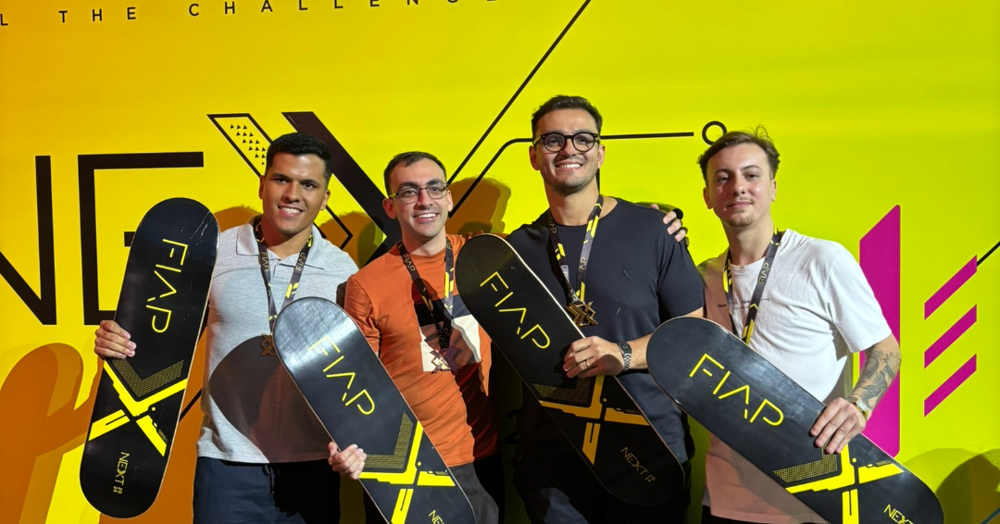

 
# Challenge iFood

## Projeto Vencedor do NEXT de 2024

## Descrição do Projeto
A FIAP, em parceria com o iFood, proporcionaram um desafio para criarmos uma aplicação destinada ao <i>backoffice</i> dos parceiros da marca. 

O projeto foi elaborado como uma <i>landing page</i> que proporciona algumas funcionalidades e interações. Como visualizações de gráficos, cadastros e edição de pedidos, gerenciamento de funcinários e um mapa de calor (representativo) para identificar o local com maior incidência de pedidos.

## Tecnologias Utilizadas

Ficamos limitados ao uso de HTML, CSS, JavaScript e Bootstrap.

  
  
  
    
  
  

## Estrutura do Projeto
Aqui estão as seções principais da nossa apresentação. As imagens abaixo representam telas e fluxos da aplicação.

|  |  |
|-------------------------------------------|---------------------------------------------|
| 
Tela de Login
       | 
Tela de Cadastro
      |

|  |    |
|-------------------------------------------|---------------------------------------------|
| 
Tela do Dashboard Financeiro (1/3)
 | 
Tela do Dashboard Financeiro (2/3)
 |

|  |  |
|-------------------------------------------|---------------------------------------------|
| 
Tela do Dashboard Financeiro (3/3)
 | 
Tela de Pedidos
        |

|    |  |
|-------------------------------------------|-----------------------------------------------|
| 
Tela de Pagamentos e Recebíveis
 | 
Tela de Controle de Segurança
 |

## Como Executar o Projeto

Acesse o site: [iFood Challenge](https://ifood-challenge-2024.vercel.app/)
